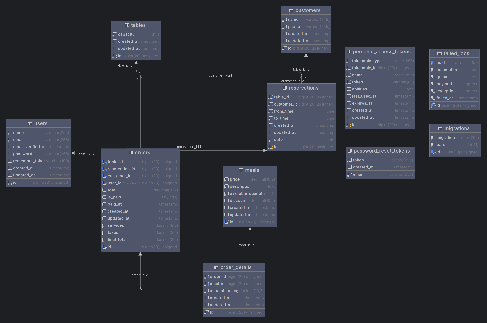

# 4Sale Task

## Application design

### ERD

<div><div>

## Development environment

### Requirements

-   [Composer](https://getcomposer.org) dependency manager

### Clone repository

```sh
git clone https://github.com/MohamedFathiM/4saleTask.git
```

### Install

Run those commands

```sh
composer install
composer run setup
```

### Database

#### Configuration

Setup a mysql database and fill in `DB_HOST`, `DB_PORT`, `DB_USERNAME`, `DB_PASSWORD`, `DB_DATABASE` in `.env` file.

#### Migration

Run this command

```sh
php artisan migrate:fresh --seed
```

### Run Tests

```sh
php artisan test
```
